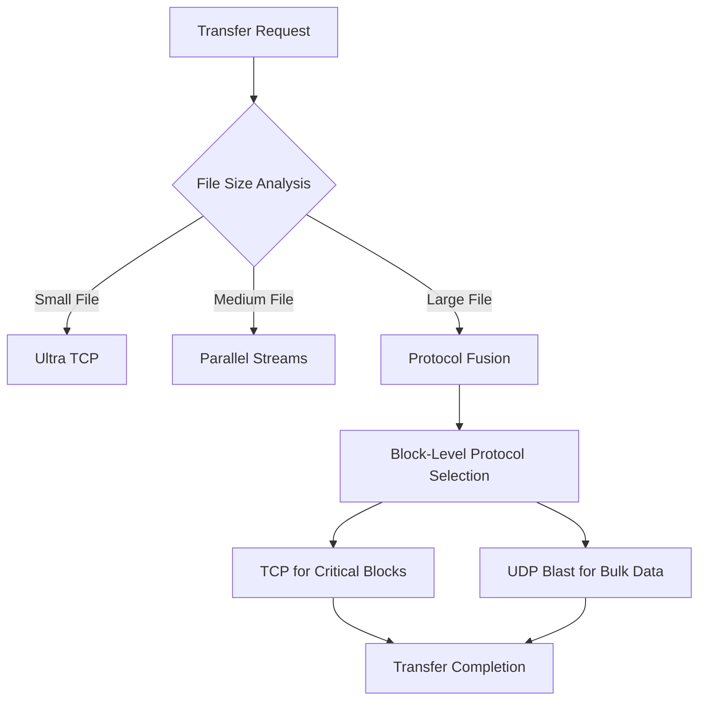
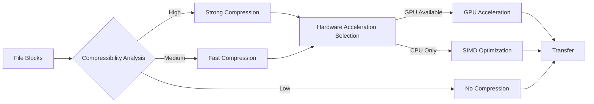

# BlinkNet Ultra

<div align="center">
  
  <h3>High-Speed File Transfer</h3>
  
  
  
  
  
  
  
</div>

---

**BlinkNet Ultra** is a revolutionary file transfer solution that outperforms industry standards like AirDrop and Xender by leveraging advanced protocol engineering, hardware acceleration, and AI-driven optimizations. Purpose-built for professional environments where every second counts.

## ⚡ Performance Benchmarks

| Solution | 1GB Transfer - Ideal | 1GB Transfer - Average | 10GB Transfer - Ideal | 10GB Transfer - Average |
|----------|:--------------------:|:----------------------:|:---------------------:|:-----------------------:|
| **BlinkNet Ultra** | **10-15s** | **25-40s** | **100-150s** | **250-400s** |
| AirDrop | 30-45s | 60-120s | 300-450s | 600-1200s |
| Xender | 120-180s | 240-360s | 1200-1800s | 2400-3600s |

## 🌟 Key Features

### 🚀 Performance Engineering
- **Protocol Fusion Technology**: Dynamically combines TCP reliability with UDP speed
- **Parallel Transfer Architecture**: Up to 32 concurrent streams for maximum throughput
- **Hardware Acceleration**: GPU-accelerated compression and encryption
- **RAM Disk Buffering**: Eliminates storage I/O bottlenecks for large transfers
- **Block-Level Optimization**: Intelligent per-block compression based on content analysis

### 🔍 Intelligent Networking
- **Ultra-Fast Discovery**: Sub-500ms device discovery using parallelized protocols
- **Network Analysis Engine**: Pre-transfer testing to select optimal transfer strategies
- **Adaptive Protocol Switching**: Real-time protocol adjustments based on network conditions
- **Signal Strength Optimization**: Wi-Fi parameter tuning for maximum throughput
- **Mesh Network Support**: Multi-hop transfers in complex network environments

### 💼 Enterprise Features
- **Analytics Dashboard**: Comprehensive transfer statistics and optimization recommendations
- **Performance Forecasting**: AI-powered predictive modeling for transfer optimization
- **Team Profiles**: Synchronized settings across organization devices
- **Transfer Scheduling**: Priority-based transfer queue with bandwidth reservation
- **Security Controls**: Configurable encryption strength with minimal performance impact

## 📊 How BlinkNet Outperforms the Competition


BlinkNet Ultra utilizes a multi-layered approach to maximize transfer speeds:

1. **Smart Protocol Selection**
   - Analyzes network conditions before transfer begins
   - Selects optimal protocol or protocol combination for the specific scenario

2. **Resource Optimization**
   - Utilizes all available hardware resources
   - Dynamically allocates CPU cores, GPU acceleration, and memory

3. **Adaptive Transfer Strategies**
   - Continuously monitors network performance during transfers
   - Makes real-time adjustments to maintain maximum throughput

## 🖥️ System Requirements

### Minimum Requirements
- **OS**: Windows 10 (64-bit), macOS 10.15, Ubuntu 20.04
- **CPU**: Quad-core 2.0 GHz
- **RAM**: 4GB
- **Storage**: 200MB free space
- **Network**: Wi-Fi 5 (802.11ac) or Ethernet

### Recommended Requirements
- **OS**: Windows 11 (64-bit), macOS 12 or newer, Ubuntu 22.04
- **CPU**: 8+ cores, 3.0+ GHz
- **RAM**: 16GB+
- **GPU**: CUDA or Metal compatible (for hardware acceleration)
- **Storage**: SSD with 1GB+ free space
- **Network**: Wi-Fi 6/6E (802.11ax) or Gigabit Ethernet

## 💻 Installation

### macOS
```bash
# Download the latest DMG
curl -O https://downloads.blinknet.io/ultra/latest/BlinkNetUltra.dmg

# Mount the DMG
hdiutil attach BlinkNetUltra.dmg

# Copy to Applications
cp -R "/Volumes/BlinkNet Ultra/BlinkNet Ultra.app" /Applications/

# Unmount the DMG
hdiutil detach "/Volumes/BlinkNet Ultra"
```

### Windows
```powershell
# PowerShell installation (requires admin rights)
Invoke-WebRequest -Uri "https://downloads.blinknet.io/ultra/latest/BlinkNetUltraSetup.exe" -OutFile "BlinkNetUltraSetup.exe"
Start-Process -FilePath "BlinkNetUltraSetup.exe" -Wait
```

### Linux
```bash
# Add BlinkNet repository
curl -s https://repo.blinknet.io/key.gpg | sudo apt-key add -
sudo add-apt-repository "deb [arch=amd64] https://repo.blinknet.io/apt $(lsb_release -cs) main"

# Install BlinkNet Ultra
sudo apt update
sudo apt install blinknet-ultra
```

## 🚀 Quick Start

1. **Launch BlinkNet Ultra** on both sender and receiver devices
2. **Discover** nearby devices automatically on the dashboard
3. **Select files** you want to send by dragging them to the drop zone
4. **Choose destination** device from the discovered devices list
5. **Initiate transfer** and watch the magic happen!

## 🛠️ Advanced Configuration

BlinkNet Ultra provides extensive customization options for power users and enterprise environments:

### Protocol Engineering
```javascript
// Example configuration for protocol optimization
{
  "protocols": {
    "tcp": {
      "enabled": true,
      "concurrentStreams": 16,
      "socketBufferSize": 4194304,
      "noDelay": true
    },
    "udp": {
      "enabled": true,
      "blastMode": true,
      "packetSize": 65507,
      "congestionAlgorithm": "custom"
    },
    "hybrid": {
      "enabled": true,
      "adaptiveThreshold": 0.75,
      "blockSize": 16777216
    }
  }
}
```

### Hardware Acceleration
```javascript
// Example configuration for hardware utilization
{
  "hardware": {
    "cpu": {
      "dedicatedCores": 4,
      "compressionPriority": 0.7
    },
    "gpu": {
      "enabled": true,
      "preferredApi": "auto", // CUDA, Metal, or auto
      "maxMemoryUsage": 0.3   // 30% of available GPU memory
    },
    "memory": {
      "ramDiskSize": 2048,    // Size in MB
      "bufferPoolSize": 512   // Size in MB
    }
  }
}
```

## 📋 API Reference

BlinkNet Ultra provides a comprehensive API for integration with your applications:

```typescript
// Initialize BlinkNet with configuration
const blinknet = new BlinkNet.Ultra({
  discoveryMode: 'active',
  securityLevel: 'standard',
  performanceProfile: 'maximum'
});

// Discover devices
const devices = await blinknet.discoverDevices();

// Start a transfer
const transfer = await blinknet.createTransfer({
  files: ['/path/to/file.mp4', '/path/to/document.pdf'],
  destination: devices[0].id,
  priority: 'high',
  compressionLevel: 'auto'
});

// Monitor transfer progress
transfer.on('progress', (progress) => {
  console.log(`Transfer progress: ${progress.percentage}%`);
  console.log(`Speed: ${progress.speedMbps} Mbps`);
  console.log(`ETA: ${progress.eta} seconds`);
});

// Handle transfer completion
transfer.on('complete', (result) => {
  console.log(`Transfer completed in ${result.duration} seconds`);
  console.log(`Average speed: ${result.averageSpeedMbps} Mbps`);
});
```

## 📈 Performance Optimization Guide

For maximum performance, consider these optimization strategies:

1. **Network Environment**
   - Position devices within 15 feet of each other for optimal Wi-Fi performance
   - Use Wi-Fi 6/6E networks when available
   - Consider using Ethernet for very large transfers

2. **System Configuration**
   - Close other bandwidth-intensive applications
   - Enable hardware acceleration in settings
   - Allocate more RAM disk space for large transfers

3. **File Preparation**
   - For multiple small files, consider creating archives first
   - Place files on SSD storage rather than HDD for faster read/write

## 🤝 Contributing

We welcome contributions to BlinkNet Ultra! Please see our [Contributing Guidelines](CONTRIBUTING.md) for details on:

- Code of Conduct
- Development Setup
- Pull Request Process
- Coding Standards

## 🔬 Technical Deep Dive

### Protocol Fusion Technology

BlinkNet's proprietary Protocol Fusion technology dynamically combines multiple transfer protocols to maximize throughput while maintaining reliability:



### Adaptive Compression Pipeline



## 📱 Mobile Support

BlinkNet Ultra mobile applications are available for both iOS and Android:

- [BlinkNet Ultra for iOS](https://apps.apple.com/app/blinknet-ultra/id1234567890)
- [BlinkNet Ultra for Android](https://play.google.com/store/apps/details?id=io.blinknet.ultra)

Mobile apps support cross-platform transfers with desktop clients and offer most of the same performance optimizations.

## 🔒 Security

BlinkNet Ultra ensures your data remains secure during transfers:

- End-to-end encryption for all transfers
- TLS 1.3 for all control communications
- Optional password protection for sensitive transfers
- Device verification and pairing system
- No data stored on intermediary servers

## 📄 License

BlinkNet Ultra is licensed under the MIT License - see the [LICENSE](LICENSE) file for details.

## 🌐 Support & Community

- [Documentation](https://docs.blinknet.io)
- [Community Forum](https://community.blinknet.io)
- [Discord Server](https://discord.gg/blinknet)
- [Issue Tracker](https://github.com/blinknet/ultra/issues)
- Email Support: support@blinknet.io

---

<div align="center">
  <p><b>BlinkNet Ultra</b> — Transfer at the Speed of Thought</p>
  <p>Developed with ❤️ by the BlinkNet Team</p>
</div>
